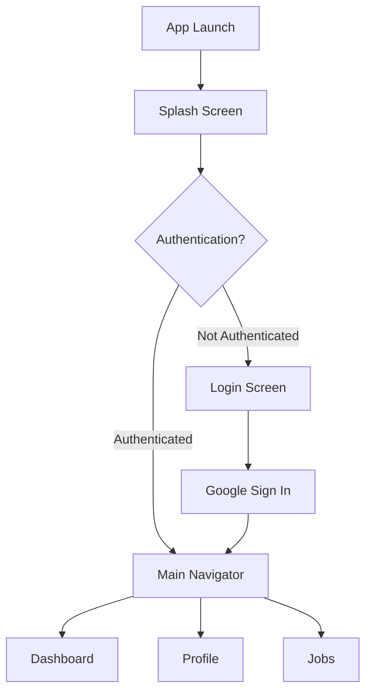
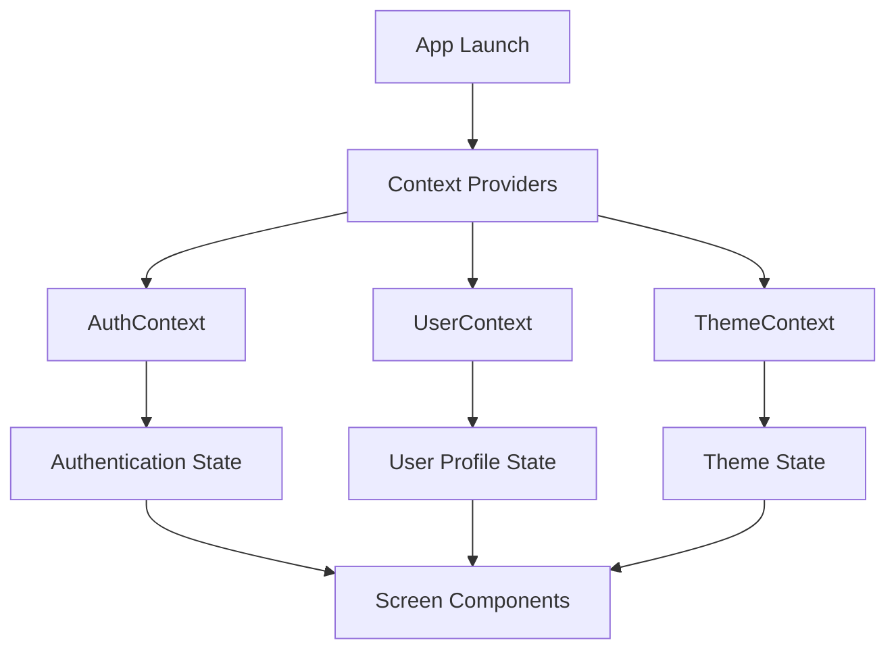
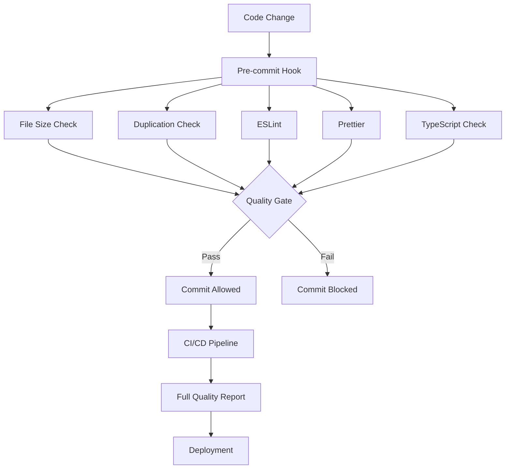
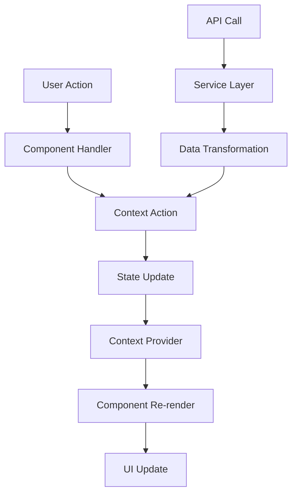

# Architecture Overview

> **Technical architecture analysis and design decisions for BasicApp React Native project**

## 🏗️ Architecture Summary

BasicApp follows a **modern React Native architecture** with clean separation of concerns, automated quality assurance, and cross-platform compatibility.

### 🎯 Architectural Principles

- **Component-Based Architecture**: Reusable UI components with consistent design system
- **Context-Driven State Management**: React Context for global state management
- **Theme-First Design**: Centralized theming system with TypeScript support
- **Quality-First Development**: Automated quality gates and continuous monitoring
- **Cross-Platform Compatibility**: Single codebase for iOS and Android

## 📊 Current Architecture Assessment

### ✅ Strengths

#### 1. **Theme System** (Excellent)

```typescript
// Well-structured theme with TypeScript support
export interface BlueWhiteTheme {
  colors: {
    background: { primary: string; secondary: string };
    text: { primary: string; secondary: string };
    primary: { main: string; light: string; dark: string };
    // ... comprehensive color system
  };
  spacing: { xs: number; sm: number; md: number; lg: number };
  typography: { h1: TypographyStyle; body: TypographyStyle };
}
```

#### 2. **UI Component Library** (Good)

```typescript
// Consistent component patterns
interface ButtonProps {
  variant: 'primary' | 'secondary' | 'outline';
  size: 'sm' | 'md' | 'lg';
  onPress: () => void;
  children: React.ReactNode;
}

const Button: React.FC<ButtonProps> = ({
  variant,
  size,
  onPress,
  children,
}) => {
  const { theme } = useTheme();
  // Implementation with theme integration
};
```

#### 3. **Development Tooling** (Excellent)

- **ESLint + Prettier**: Automated code formatting
- **TypeScript**: Strict type checking
- **Husky**: Git hooks for quality enforcement
- **Automated Testing**: Jest with coverage reporting
- **Quality Gates**: Pre-commit and CI/CD validation

### ⚠️ Areas for Improvement

#### 1. **File Size Issues** (Critical)

```typescript
// 🔴 Problem: Oversized files
IndexScreen.jsx: 1,008 lines  // Should be < 300
CreateJobScreen.jsx: 667 lines
MyJobsScreen.jsx: 563 lines

// ✅ Solution: Component decomposition
// Split IndexScreen into:
// - HeroSection (100 lines)
// - FeaturesSection (80 lines)
// - StatsSection (60 lines)
// - FooterSection (40 lines)
```

#### 2. **Component Duplication** (High Priority)

```typescript
// 🔴 Problem: Duplicate button implementations
/src/components/ui/Button.jsx (163 lines)
/src/components/ThemedButton.tsx (194 lines)

// ✅ Solution: Consolidate into single implementation
// Keep ThemedButton.tsx as primary, remove Button.jsx
```

#### 3. **Theme Duplication** (High Priority)

```typescript
// 🔴 Problem: Duplicate theme files
/src/theme/bluewhite.ts (425 lines)
/src/theme/bluewhite-theme.js (284 lines)

// ✅ Solution: Use TypeScript theme as single source
// Remove bluewhite-theme.js, migrate all imports
```

## 🗂️ Architecture Layers

### 1. **Presentation Layer**

```
src/
├── screens/              # Screen components
│   ├── IndexScreen.jsx   # Landing page (needs refactoring)
│   ├── DashboardScreen.jsx
│   ├── AppliedJobsScreen.jsx
│   └── ...
├── components/           # Reusable UI components
│   ├── ui/              # Core UI library
│   │   ├── Button.jsx   # (TO BE REMOVED)
│   │   ├── Card.jsx
│   │   ├── Input.jsx
│   │   └── Badge.jsx
│   ├── ThemedButton.tsx # (PRIMARY BUTTON)
│   ├── ThemedCard.tsx
│   └── themed/          # Themed component exports
└── navigation/          # Navigation configuration
    └── MainNavigator.jsx
```

### 2. **Business Logic Layer**

```
src/
├── contexts/            # Global state management
│   ├── AuthContext.jsx  # Authentication state
│   ├── UserContext.jsx  # User profile state
│   ├── ProfileContext.jsx # Profile switching
│   └── ThemeContext.jsx # Theme management
├── hooks/               # Custom React hooks
│   └── (to be created)
└── services/            # API and external services
    └── (to be created)
```

### 3. **Data Layer**

```
src/
├── utils/               # Utility functions
│   └── supabase.js     # Supabase client
├── types/              # TypeScript definitions
│   └── styled.d.ts     # Styled-components types
└── theme/              # Design system
    ├── bluewhite.ts    # Primary theme (TypeScript)
    ├── bluewhite-theme.js # (TO BE REMOVED)
    ├── colors.js
    ├── typography.js
    └── spacing.js
```

## 🧭 Navigation Architecture

### Current Implementation

```typescript
// App.jsx - Main app structure
const App = () => {
  return (
    <ThemeProvider>
      <ErrorBoundary>
        <AuthProvider>
          <UserProvider>
            <ProfileProvider>
              <NavigationContainer>
                <AppNavigator />
              </NavigationContainer>
            </ProfileProvider>
          </UserProvider>
        </AuthProvider>
      </ErrorBoundary>
    </ThemeProvider>
  );
};
```

### Navigation Flow



## 🎨 Design System Architecture

### Theme Structure

```typescript
// Comprehensive theme system
export const bluewhiteTheme: BlueWhiteTheme = {
  colors: {
    background: {
      primary: '#FFFFFF',
      secondary: '#F8FAFC',
      tertiary: '#F1F5F9',
    },
    text: {
      primary: '#1E293B',
      secondary: '#475569',
      tertiary: '#94A3B8',
    },
    primary: {
      main: '#3C4FE0',
      light: '#6366F1',
      dark: '#1E40AF',
    },
    // ... comprehensive color system
  },
  spacing: {
    xs: 4,
    sm: 8,
    md: 16,
    lg: 24,
    xl: 32,
    xxl: 48,
  },
  typography: {
    h1: { fontSize: 32, fontWeight: 'bold', lineHeight: 40 },
    h2: { fontSize: 28, fontWeight: 'bold', lineHeight: 36 },
    body: { fontSize: 16, fontWeight: 'normal', lineHeight: 24 },
    // ... complete typography system
  },
};
```

### Component Design System

```typescript
// Standardized component patterns
interface ComponentProps {
  variant: 'primary' | 'secondary' | 'outline';
  size: 'sm' | 'md' | 'lg';
  // ... consistent prop patterns
}

// Theme integration
const Component: React.FC<ComponentProps> = ({ variant, size }) => {
  const { theme } = useTheme();

  const styles = useMemo(
    () =>
      StyleSheet.create({
        container: {
          backgroundColor: theme.colors.background.primary,
          padding: theme.spacing.md,
          borderRadius: theme.borderRadius.md,
        },
      }),
    [theme],
  );

  return <View style={styles.container} />;
};
```

## 🔧 State Management Architecture

### Context-Based State Management

```typescript
// Authentication Context
interface AuthContextType {
  isAuthenticated: boolean;
  user: User | null;
  login: (credentials: Credentials) => Promise<void>;
  logout: () => Promise<void>;
  isLoading: boolean;
}

const AuthContext = createContext<AuthContextType | undefined>(undefined);

// User Context
interface UserContextType {
  profile: UserProfile | null;
  updateProfile: (updates: Partial<UserProfile>) => Promise<void>;
  preferences: UserPreferences;
  updatePreferences: (updates: Partial<UserPreferences>) => void;
}

const UserContext = createContext<UserContextType | undefined>(undefined);
```

### State Flow



## 🛡️ Quality Architecture

### Automated Quality System

```typescript
// Quality monitoring pipeline
interface QualityMetrics {
  overall: number; // Overall quality score (0-100)
  fileSize: number; // File size compliance score
  duplication: number; // Code duplication score
  testCoverage: number; // Test coverage percentage
  typescript: number; // TypeScript usage percentage
  performance: number; // Performance optimization score
}

interface QualityThresholds {
  overall: 70;
  fileSize: 60;
  duplication: 70;
  testCoverage: 60;
  typescript: 50;
  performance: 60;
}
```

### Quality Gate Flow



## 📱 Platform Architecture

### Cross-Platform Strategy

```typescript
// Platform-specific handling
import { Platform } from 'react-native';

const PlatformComponent = () => {
  const styles = useMemo(
    () =>
      StyleSheet.create({
        container: {
          ...Platform.select({
            ios: {
              shadowColor: '#000',
              shadowOffset: { width: 0, height: 2 },
              shadowOpacity: 0.1,
              shadowRadius: 4,
            },
            android: {
              elevation: 4,
            },
          }),
        },
      }),
    [],
  );

  return <View style={styles.container} />;
};
```

### Build Configuration

```typescript
// Android Configuration
android: {
  compileSdkVersion: 35,
  targetSdkVersion: 35,
  minSdkVersion: 24,
  buildToolsVersion: '35.0.0',
  ndkVersion: '29.0.13599879',
}

// iOS Configuration
ios: {
  deploymentTarget: '12.0',
  requiresFullScreen: false,
  supportsTablet: true,
}
```

## 🔄 Data Flow Architecture

### Unidirectional Data Flow



### API Integration Pattern

```typescript
// Service layer pattern
interface ApiService {
  get<T>(endpoint: string): Promise<T>;
  post<T>(endpoint: string, data: any): Promise<T>;
  put<T>(endpoint: string, data: any): Promise<T>;
  delete<T>(endpoint: string): Promise<T>;
}

// Context integration
const useApiData = <T>(endpoint: string) => {
  const [data, setData] = useState<T | null>(null);
  const [loading, setLoading] = useState(false);
  const [error, setError] = useState<string | null>(null);

  const fetchData = useCallback(async () => {
    setLoading(true);
    setError(null);

    try {
      const result = await apiService.get<T>(endpoint);
      setData(result);
    } catch (err) {
      setError(err instanceof Error ? err.message : 'Unknown error');
    } finally {
      setLoading(false);
    }
  }, [endpoint]);

  return { data, loading, error, refetch: fetchData };
};
```

## 🚀 Performance Architecture

### Optimization Strategies

```typescript
// Component optimization
const OptimizedComponent = memo(({ data, onUpdate }) => {
  // Memoized calculations
  const processedData = useMemo(
    () => data.map(item => ({ ...item, processed: true })),
    [data],
  );

  // Memoized callbacks
  const handleUpdate = useCallback(
    (id: string) => {
      onUpdate(id);
    },
    [onUpdate],
  );

  // Optimized list rendering
  return (
    <FlatList
      data={processedData}
      renderItem={({ item }) => (
        <ItemComponent item={item} onUpdate={handleUpdate} />
      )}
      keyExtractor={item => item.id}
      getItemLayout={(data, index) => ({
        length: 60,
        offset: 60 * index,
        index,
      })}
      maxToRenderPerBatch={10}
      windowSize={5}
    />
  );
});
```

## 🎯 Recommended Architecture Improvements

### Phase 1: Critical Fixes (Immediate)

1. **File Size Reduction**

   ```typescript
   // Break down IndexScreen.jsx (1,008 lines)
   // Into: HeroSection, FeaturesSection, StatsSection, FooterSection
   ```

2. **Component Consolidation**

   ```typescript
   // Remove duplicate Button implementation
   // Keep ThemedButton.tsx as primary
   ```

3. **Theme Consolidation**
   ```typescript
   // Remove bluewhite-theme.js
   // Migrate all imports to bluewhite.ts
   ```

### Phase 2: Architecture Enhancement (Short-term)

1. **Custom Hooks Layer**

   ```typescript
   // Create custom hooks for business logic
   src/hooks/
   ├── useAuth.ts          # Authentication logic
   ├── useApi.ts           # API integration
   ├── useTheme.ts         # Theme management
   └── useNavigation.ts    # Navigation helpers
   ```

2. **Service Layer**
   ```typescript
   // Create service layer for API calls
   src/services/
   ├── authService.ts      # Authentication API
   ├── userService.ts      # User management API
   ├── jobService.ts       # Job-related API
   └── apiClient.ts        # HTTP client
   ```

### Phase 3: Advanced Features (Long-term)

1. **State Management Enhancement**

   ```typescript
   // Consider Redux Toolkit for complex state
   // Or Zustand for lightweight state management
   ```

2. **Testing Architecture**
   ```typescript
   // Comprehensive testing strategy
   __tests__/
   ├── components/         # Component unit tests
   ├── screens/           # Screen integration tests
   ├── hooks/             # Custom hooks tests
   ├── services/          # Service layer tests
   └── e2e/               # End-to-end tests
   ```

## 📊 Architecture Metrics

### Current State

- **Total Files**: 46 source files
- **Largest File**: IndexScreen.jsx (1,008 lines)
- **Duplicate Components**: 2 Button implementations
- **Quality Score**: ~65/100 (needs improvement)

### Target State

- **Max File Size**: 300 lines
- **Zero Duplication**: Single source of truth
- **Quality Score**: 80+/100
- **Test Coverage**: 80%+

## 🔗 Architecture Dependencies

### Core Dependencies

- **React Native**: 0.74.7 (UI framework)
- **React Navigation**: 7.x (Navigation)
- **TypeScript**: 5.0.4 (Type safety)
- **Styled Components**: 6.1.19 (Styling)

### Quality Dependencies

- **ESLint**: Code quality
- **Prettier**: Code formatting
- **Husky**: Git hooks
- **Jest**: Testing framework

## 📈 Future Architecture Considerations

### Scalability

- **Micro-frontend approach** for large teams
- **Module federation** for code sharing
- **Monorepo structure** for multi-app projects

### Performance

- **Code splitting** for larger applications
- **Lazy loading** for screens and components
- **Bundle optimization** for faster startup

### Maintainability

- **Documentation generation** from code
- **Automated architecture validation**
- **Dependency analysis** and updates

---

**Architecture is constantly evolving. This document should be updated as the project grows and requirements change.**

For more information, see:

- [Development Guide](DEVELOPMENT.md)
- [Code Quality Guidelines](CODE_QUALITY.md)
- [Automated Review Setup](AUTOMATED_REVIEW.md)
