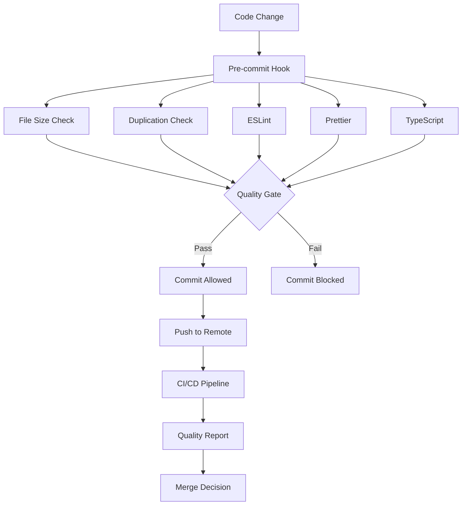

# Automated Code Review & Quality System

> **Complete setup and usage guide for the automated code review system**

## 🎯 Overview

This system provides comprehensive automated code review capabilities including:

- **Pre-commit quality checks** with file size, duplication, and style validation
- **CI/CD integration** with GitHub Actions
- **Quality scoring** with automated reporting
- **Commit message validation** with conventional commit format
- **Real-time quality monitoring** with trend analysis

## 🚀 Quick Setup

### 1. Install Dependencies

```bash
# Additional quality tools
npm install --save-dev depcheck bundlesize codecov @types/node

# Ensure Husky is configured
npx husky install
```

### 2. Make Scripts Executable

```bash
# Make all scripts executable
chmod +x scripts/*.js
chmod +x .husky/*
```

### 3. Test the System

```bash
# Test quality checks
npm run quality:check

# Generate quality report
npm run quality:report

# Test pre-commit hooks
echo "// Test change" >> src/components/ui/Button.jsx
git add .
git commit -m "test: validate pre-commit hooks"
```

## 📊 Quality Scoring System

### Score Calculation

The system calculates an overall quality score (0-100) based on:

- **File Size (20%)**: Penalty for files exceeding limits
- **Code Duplication (25%)**: Penalty for duplicate code patterns
- **Test Coverage (30%)**: Percentage of code covered by tests
- **TypeScript Usage (15%)**: Percentage of .ts/.tsx files
- **Performance (10%)**: Optimization opportunities

### Quality Thresholds

```javascript
const QUALITY_THRESHOLDS = {
  overall: 70, // Overall score must be >= 70
  fileSize: 60, // File size score must be >= 60
  duplication: 70, // Code duplication score must be >= 70
  testCoverage: 60, // Test coverage must be >= 60%
  typescript: 50, // TypeScript usage must be >= 50%
  performance: 60, // Performance score must be >= 60
};
```

## 🔧 Available Commands

### Quality Check Commands

```bash
# Quick validation
npm run quality:check    # File size & duplication check
npm run quality:report   # Generate comprehensive report
npm run quality:gate     # Run quality gate validation
npm run quality:full     # Complete quality pipeline

# Core development
npm run cleanup         # Format, lint, and type-check
npm run test:coverage   # Run tests with coverage
npm run security:audit  # Security vulnerability scan
```

### Individual Check Commands

```bash
# Specific checks
node scripts/check-file-sizes.js     # File size validation
node scripts/check-duplicates.js     # Duplication detection
node scripts/validate-commit-msg.js  # Commit message validation
node scripts/generate-quality-report.js # Quality report generation
```

## 🛠️ System Components

### 1. Pre-commit Hooks

**File**: `.husky/pre-commit`

Runs automatically on every commit:

- File size analysis
- Code duplication detection
- ESLint validation
- Prettier formatting
- TypeScript compilation
- Related test execution

### 2. Commit Message Validation

**File**: `.husky/commit-msg`

Validates commit messages for:

- Conventional commit format
- Proper message length
- Imperative mood
- No trailing periods

### 3. Quality Analysis Scripts

#### File Size Checker

**File**: `scripts/check-file-sizes.js`

```javascript
// File size limits
const SIZE_LIMITS = {
  components: 200, // Max 200 lines for components
  screens: 300, // Max 300 lines for screens
  contexts: 200, // Max 200 lines for contexts
  utils: 150, // Max 150 lines for utilities
  default: 250, // Default limit
};
```

#### Duplication Detector

**File**: `scripts/check-duplicates.js`

Detects:

- Similar component structures
- Duplicate styling patterns
- Repeated import statements
- Identical utility functions

#### Quality Reporter

**File**: `scripts/generate-quality-report.js`

Generates:

- Comprehensive quality metrics
- Issue identification
- Improvement recommendations
- Trend analysis

### 4. GitHub Actions Workflow

**File**: `.github/workflows/code-quality.yml`

CI/CD pipeline with:

- Code quality validation
- Security scanning
- Performance testing
- Bundle size analysis
- Automated PR comments

## 📋 File Size Standards

### Size Limits by File Type

| File Type  | Max Lines | Check Location    |
| ---------- | --------- | ----------------- |
| Components | 200       | `src/components/` |
| Screens    | 300       | `src/screens/`    |
| Contexts   | 200       | `src/contexts/`   |
| Utilities  | 150       | `src/utils/`      |
| Services   | 200       | `src/services/`   |
| Default    | 250       | All other files   |

### Handling Oversized Files

```bash
# Check current file sizes
npm run quality:check

# Find largest files
find src -name "*.js" -o -name "*.jsx" -o -name "*.ts" -o -name "*.tsx" | xargs wc -l | sort -nr | head -10

# The system will block commits with oversized files
# Refactor large files into smaller components
```

## 🔍 Duplication Detection

### Detected Patterns

The system checks for:

1. **Similar Function Structures**

   ```javascript
   // Pattern detected: const functionName = () => {}
   ```

2. **Duplicate Styling**

   ```javascript
   // Pattern detected: StyleSheet.create({ ... })
   ```

3. **Repeated Imports**

   ```javascript
   // Pattern detected: import ... from '...'
   ```

4. **Identical Functions**
   ```javascript
   // Functions with same name in different files
   ```

### Duplication Remediation

```bash
# Check for duplicates
npm run quality:check

# Manual refactoring steps:
# 1. Extract common patterns into utilities
# 2. Create shared components
# 3. Use theme system for styling
# 4. Consolidate similar functions
```

## 📝 Commit Message Validation

### Conventional Commit Format

```bash
# Required format: type(scope): description
feat: add user authentication
fix: resolve navigation memory leak
docs: update API documentation
style: fix component spacing
refactor: optimize button performance
test: add unit tests for user service
```

### Valid Commit Types

- `feat`: New feature
- `fix`: Bug fix
- `docs`: Documentation changes
- `style`: Code style changes
- `refactor`: Code refactoring
- `test`: Test additions/changes
- `chore`: Maintenance tasks
- `perf`: Performance improvements
- `ci`: CI/CD changes
- `build`: Build system changes
- `revert`: Revert previous commit

### Validation Rules

```javascript
const COMMIT_RULES = {
  minLength: 10, // Minimum message length
  maxLength: 100, // Maximum message length
  requireType: true, // Must have commit type
  requireDescription: true, // Must have description
  imperativeMood: true, // Use imperative mood
  noTrailingPeriod: true, // No trailing periods
};
```

## 🎯 Quality Gate Configuration

### Quality Gate Flow



### Customizing Thresholds

Edit `scripts/quality-gate.js`:

```javascript
const QUALITY_THRESHOLDS = {
  overall: 70, // Adjust as needed
  fileSize: 60, // Adjust as needed
  duplication: 70, // Adjust as needed
  testCoverage: 60, // Adjust as needed
  typescript: 50, // Adjust as needed
  performance: 60, // Adjust as needed
};
```

## 📊 Quality Reports

### Report Types

1. **JSON Report**: `quality-report.json`

   ```json
   {
     "timestamp": "2024-01-15T10:30:00Z",
     "scores": {
       "overall": 75,
       "fileSize": 80,
       "duplication": 70,
       "testCoverage": 65,
       "typescript": 85,
       "performance": 70
     },
     "issues": [...],
     "recommendations": [...]
   }
   ```

2. **Markdown Report**: `quality-report.md`

   - Human-readable format
   - Detailed issue breakdown
   - Improvement recommendations
   - Trend analysis

3. **Console Summary**: Real-time feedback
   ```bash
   📊 CODE QUALITY REPORT SUMMARY
   Overall Score: 75/100 🟡 Good
   Issues Found: 3 medium, 1 high
   ```

### Report Generation

```bash
# Generate reports
npm run quality:report

# View reports
cat quality-report.json
cat quality-report.md
```

## 🔧 CI/CD Integration

### GitHub Actions Workflow

The system includes a comprehensive GitHub Actions workflow:

1. **Code Quality Job**

   - ESLint validation
   - Prettier check
   - TypeScript compilation
   - Test execution with coverage
   - File size validation
   - Duplication detection

2. **Performance Test Job**

   - Bundle size analysis
   - Performance benchmarks
   - Optimization recommendations

3. **Security Scan Job**

   - Dependency vulnerability scan
   - CodeQL security analysis
   - Security best practices check

4. **Quality Gate Job**
   - Quality report generation
   - Threshold validation
   - PR comment with results

### Setting Up CI/CD

1. **GitHub Actions**: Already configured in `.github/workflows/code-quality.yml`
2. **Environment Variables**: Set in GitHub repository settings
3. **Branch Protection**: Configure required status checks
4. **Merge Requirements**: Quality gate must pass

## 🛠️ Customization & Extension

### Adding Custom Checks

1. **Create new script** in `scripts/` directory
2. **Add to pre-commit hook** in `.husky/pre-commit`
3. **Update CI/CD workflow** in `.github/workflows/code-quality.yml`
4. **Add to package.json** scripts

Example custom check:

```javascript
// scripts/check-imports.js
const fs = require('fs');
const path = require('path');

function checkImports() {
  // Custom import validation logic
  console.log('🔍 Checking import statements...');

  // Implementation

  console.log('✅ Import validation passed');
}

if (require.main === module) {
  checkImports();
}
```

### Modifying File Size Limits

Edit `scripts/check-file-sizes.js`:

```javascript
const SIZE_LIMITS = {
  components: 150, // Stricter limit
  screens: 250, // Stricter limit
  contexts: 180, // Stricter limit
  utils: 100, // Stricter limit
  default: 200, // Stricter default
};
```

### Adding Quality Metrics

Edit `scripts/generate-quality-report.js`:

```javascript
// Add new metric
async analyzeDependencies() {
  const packageJson = require('../package.json');
  const dependencies = Object.keys(packageJson.dependencies);
  const outdated = await checkOutdatedDependencies(dependencies);

  this.report.metrics.dependencies = {
    total: dependencies.length,
    outdated: outdated.length,
    score: Math.max(0, 100 - (outdated.length * 10))
  };
}
```

## 📈 Monitoring & Maintenance

### Daily Monitoring

```bash
# Check quality status
npm run quality:report

# Monitor trends
git log --oneline | head -10
npm run quality:full
```

### Weekly Maintenance

1. **Review quality reports**
2. **Update quality thresholds** if needed
3. **Address persistent issues**
4. **Update dependencies**

### Monthly Tasks

1. **Analyze quality trends**
2. **Review and update standards**
3. **Team quality retrospective**
4. **Tool updates and improvements**

## 🚨 Troubleshooting

### Common Issues

#### Pre-commit Hooks Not Running

```bash
# Reinstall Husky
npm run prepare
npx husky install
```

#### Scripts Not Executable

```bash
# Fix permissions
chmod +x scripts/*.js
chmod +x .husky/*
```

#### Quality Gate Failures

```bash
# Check specific issues
npm run quality:check

# Fix common problems
npm run cleanup

# Generate detailed report
npm run quality:report
```

#### CI/CD Failures

```bash
# Check GitHub Actions logs
# Review quality-report.md
# Fix issues locally and push
```

## 🎯 Best Practices

### Development Workflow

1. **Before starting work**

   ```bash
   npm run quality:check
   ```

2. **During development**

   ```bash
   npm run cleanup  # Regularly
   ```

3. **Before committing**

   ```bash
   npm run quality:full
   ```

4. **After PR creation**
   - Review quality report in PR comments
   - Address any issues found
   - Monitor CI/CD pipeline

### Team Collaboration

1. **Code Reviews**: Use quality reports to guide reviews
2. **Standards**: Regularly update quality thresholds
3. **Training**: Ensure team understands quality system
4. **Feedback**: Collect feedback and improve system

## 📚 Additional Resources

### Documentation

- [Code Quality Guidelines](CODE_QUALITY.md)
- [Development Guide](DEVELOPMENT.md)
- [Architecture Overview](ARCHITECTURE.md)

### Tools

- [ESLint Documentation](https://eslint.org/docs/user-guide/)
- [Prettier Documentation](https://prettier.io/docs/en/)
- [Husky Documentation](https://typicode.github.io/husky/)
- [Jest Documentation](https://jestjs.io/docs/getting-started)

### Quality Resources

- [Clean Code Principles](https://cleancoders.com/)
- [React Best Practices](https://reactjs.org/docs/thinking-in-react.html)
- [TypeScript Best Practices](https://www.typescriptlang.org/docs/handbook/declaration-files/do-s-and-don-ts.html)

---

**The automated review system is designed to maintain high code quality while minimizing developer friction. Regular monitoring and adjustment ensure it stays effective as the project evolves.**

For more information, see:

- [Development Guide](DEVELOPMENT.md)
- [Code Quality Guidelines](CODE_QUALITY.md)
- [Architecture Overview](ARCHITECTURE.md)
